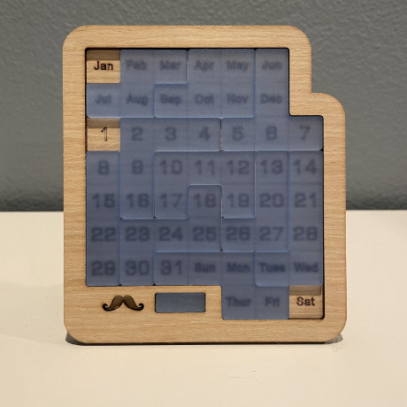

# Daily Calendar Puzzle Solver

Adding a python backtracking solution for the Daily Calendar Puzzle.  The calendar being solved for looks like this:

However the code can be adapted to solve other puzzles.  Feel free to use and hope you enjoy.

For an easy no setup environment to run the notebook, try it on Google Colab at:
https://colab.research.google.com/github/jeffthebear/daily-calendar-puzzle/blob/main/calendar-solver.ipynb
